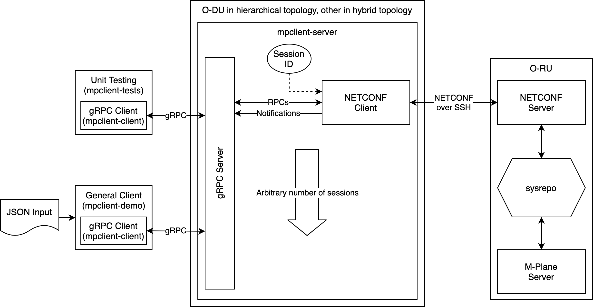

# mplane_client Implementation

## Architecture

## Design Decisions
This section explains key design decisions for the M-Plane client software:

* mplane_client uses a client-server architecture.
    * The RPC server can run as a background process, meaning that users do not
      have to create new processes to interact with the M-Plane client.
    * This provides a layer of abstraction which makes the M-Plane client
      independent of language or platform.
* mplane_client is agnostic of network architecture.
    * It does not matter from where mplane_client runs. It can be from a DU (in
      hierarchical mode) or from any other piece of hardware (in hybrid mode).
* The gRPC framework is used to implement Remote Procedure Calls (RPCs).
    * gRPC is one of the most commonly used frameworks and is well-understood by
      the open source community.
    * Other protocols like gNMI also utilize gRPC.
* A single mplane_client multiplexes over an arbitrary number of M-Plane
  sessions.
    * This reflects the cardinality of DUs and RUs (i.e. one-to-many).
    * This eliminates a degree of complexity because a new mplane_client
      instance does not need to start whenever a new M-Plane session is
      desired.
    * This means that every mplane_client RPC is associated with a session ID,
      either as an input or an output.
* mplane_client is built, tested, and run in a Dockerized environment.
    * This portability is important for open source development.
    * O-RAN supplies an [O1 interface
      simulator](https://github.com/o-ran-sc/sim-o1-interface) which is
      Dockerized and supplies useful testing infrastructure.
* mplane_client is independent of the M-Plane server implementation.
    * Since sysrepo serves as an intermediary between the NETCONF server (which
      is the same for every M-Plane server) and the actual M-Plane server
      implementation, mplane_client can treat the M-Plane server as an
      interface without knowing any implementation details.
* mplane_client is independent of the YANG modules running on an RU.
    * This reduces the complexity of mplane_client and means that mplane_client
      does not have to update as YANG modules are changed.

## M-Plane Client Features
This section describes how mplane_client supports each section of the O-RAN WG4
M-Plane client specification.

### Section 3: Connectivity
mplane_client has capabilities for direct connection and for Call Home.
Capability exchange is not automatic, but capabilities can be discovered by
calling `<get>` on the XPath
`ietf-netconf-monitoring:netconf-state/capabilities`.

### Section 4: Interface Management
The portions with which the M-Plane client is involved are configurations which
can be managed using `<get>` and `<edit-config>`.

### Section 5: Software Management
Software management uses YANG to manage software slots and the filesystem, and
sFTP moves files onto the RU. Most of the necessary NETCONF RPCs are found in
the `o-ran-software-management` module.

### Section 6: Configuration Management
Configuration management is handled with NETCONF RPCs such as `<get>`,
`<edit-config>`, `<lock>`, and `<unlock>`.

### Section 7: Performance Management
Statistics are collected in read-only YANG leaves, and these values can be
accessed directly using `<get>`. One can also subscribe to notifications.

### Section 8: Fault Management
In general, if a fault is detected, an alarm is raised in the form a NETCONF
notification. These notifications can be subscribed using
`<create-subscription>` to `alarm-notif`.

### Section 9: File Management
Actual files are transferred over FTP (the RU is supposed to contain an FTP
client that connects to an outside server beyond the scope of the M-Plane
client). File transfers and management are handled via NETCONF RPCs and
notifications.

### Section 10: Synchronization Aspects
The M-Plane client is not involved in synchronization between the RU and DU.

### Remaining Sections
The remaining sections are more hardware-oriented. In general, the data
describing a hardware configuration can be fetched with `<get>` or
`<get-config>`, edited with `<edit-config>`, and anything that produces a
notification can be interacted with using `streamNotifications`.

## Developer Manual
This section is written for maintainers/advanced users of mplane_client.

### Build Script Guide
There are a number of scripts used to automate the mplane_client build process.

* **get_deps.sh**: this script fetches dependencies needed for building
  mplane_client. It stores the files in `deps`.
    * `--dnf-deps`: this option tells the script to download RPMs and their
      recursive dependencies from the CentOS 8 repository using the "dnf
      download" feature and store them in `deps/centos8-rpms/`. This feature
      helps when the machine on which mplane_client is installed cannot access
      the internet.
* **build_deps.sh**: this script builds and installs the dependencies obtained
  by `get_deps.sh`. It installs binaries in `deps/install/`.
    * `--dnf-deps`: use this if you used the same flag in `get_deps.sh`.
    * `--no-netopeer2`: this option tells the script not to install netopeer2.
      netopeer2 is installed by default because it is a useful debugging tool,
      but two netopeer2 installations cannot coexist on the same system.
* **build_mpclient.sh**: this script builds mplane_client in `build`.
    * `--parallel <n>`: use this to specify number of parallel build threads
      (default is n=1)
* **build_docker.sh**: this script builds the Docker testing environment image.
  The image is called `mplane/mpclient-tester`. The testing environment can be
  launched by running `docker-compose up`, and the container be entered by
  running `docker exec -it mpclient_mpclient-tester_1`.

### CMake Guide
`CMakeLists.txt` is the only file specifying how mplane_client builds. It has
targets for protobufs and gRPC stubs, the rpc-client static library (see below),
`mpc_client`, `mpc_tester`, and `mpclient-demo`.

### What is the `test/rpc-client` directory?
Since multiple C++ clients access the client gRPC stub, and it can be painful to
populate protobufs in C++, the `test/rpc-client` abstraction layer was added to
make the process of initiating mplane_client RPCs easier. It consists of a
single pair of header and source files.

### Docker Testing Environment
To make the software independent of platform and Meta infrastructure and
provide a consistent testing environment, there is the option of building and
running mplane_client with Docker.

**Docker Images**:
* `o-ran-sc/nts-ng-o-ran-ru-fh`: this is a Docker image published by O-RAN as a
  testing environment for the O1 interface. This provides a simulated RU with
  the proper YANG modules installed and populated with sample data.
* `mplane/mpclient-tester`: this is based on `o-ran-sc/nts-ng-o-ran-ru-fh`,
  and it adds the build dependencies for mplane_client. Since the source code
  (located in `src`) for mplane_client is not copied into this image, it needs
  to be included using a mount.
* `mplane/mpclient-built-tests`: this is based on `mplane/mpclient-tester`,
  and it adds pre-built binaries for mplane_client, automatically generated TLS
  keys, and an instance of mpc_client running in the background.

**Files**:
* `docker-images.yaml`: this is a list of Docker images to build when
  `docker-compose build` is run.
* `docker-compose.yaml`: this provides default file system mounting, environment
  variables, and opened ports.
* `Dockerfile`: this is the specification for `mplane/mpclient-tester`.
* `tests.Dockerfile`: this is the specification for
  `mplane/mpclient-built-tests`.

### libyang/libnetconf2 Versioning
Around June 2021, libyang, libnetconf2, sysrepo, and netopeer2 upgraded from
version 1 to version 2, and version 1 has been deprecated. mplane_client remains
on version 1. The main issue while upgrading is that it seems that versions 1
and 2 cannot coexist on the same system, and it is unknown whether versions 1
and 2 can coexist on different systems (i.e. the NETCONF server and client run
on separate machines).

### Aliases for Commonly-Used Commands
Some aliases for frequently-used NETCONF RPCs, such as `<get>`, `<get-config>`,
`<edit-config>`, and `<subscribe>`, may be useful in the future so that users
don't have to write full XML for otherwise basic RPCs. This could be
advantageous under the principle of "optimize for the common case", and as long
as aliasing is limited to schemas that will never change, it won't break the
YANG-independence design decision. Aliases are not presently implemented because
they fall under the category of "potentially useful, but we do not yet know
enough about the exact use-cases for it to be a worthwhile investment of time."

### Synchronous gRPC API
The gRPC API is synchronous because all mplane_client operations need to be
atomic with respect to all other mplane_client operations. Having an
asynchronous API adds nothing besides unneeded complexity.

### Transparency vs. Static Checking
In order to decouple mplane_client from the YANG models used on an RU, the
decision was made for mplane_client to transfer encoded data without caring
about its contents. This has the advantage of removing concerns about version
compatibility when potentially dealing with networks whose nodes are on
different versions of the O-RAN specification. However, the tradeoff is that
when YANG models change, clients (like the NMS) can silently fall out of sync
with the server (which controls the YANG models used in the whole system) and
lead to runtime errors.

One possible solution to this problem would be compiling YANG models into
Protobuf messages using libraries such as
[ygot](https://github.com/openconfig/ygot/blob/master/docs/yang-to-protobuf-transformations-spec.md)
so that clients are forced to use a statically-compiled schema when constructing
queries. This would sacrifice flexibility for static correctness.
